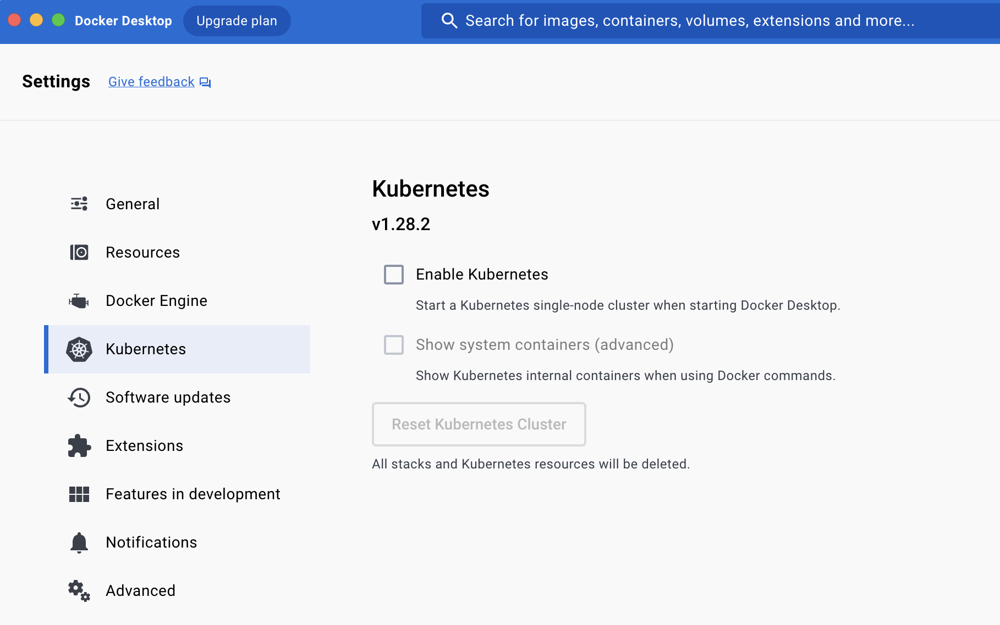

# gitops tutorial

쿠버네티스코리아 커뮤니티 기술 세미나 2023/11/29

Github action 과 ArgoCD 를 활용해서 로컬 쿠버네티스 클러스터에 CICD 구현해보기

### 레포 구조

- [cicd-tut-source](https://github.com/protess/cicd-tut-source) : Github action 과 소스레포
- [gitops-tutorial](https://github.com/protess/gitops-tutorial/tree/main) : Gitops, ArgoCD, 로컬 k8s 클러스터


### 디렉토리 구조
```
.
├── LICENSE
├── README.md
├── cd
│   └── gitops-tutorial.yaml
├── devops
│   ├── alpine-tools
│   │   ├── Dockerfile
│   │   ├── README.md
│   │   └── debug-pod.yaml
│   ├── argocd
│   │   └── README.md
│   └── kind-cluster
│       └── kind-cluster.yaml
└── img
    └── docker-desktop-k8s.png

7 directories, 9 files
```

## 로컬 쿠버네티스 클러스터 설정

[KIND install](https://kind.sigs.k8s.io/docs/user/quick-start/)

```
brew install kind
```
# Create Kind Cluster
```
cd kind-cluster

kind create cluster --config=./kind-cluster.yaml

# verify cluster
kind get clusters

# delete cluster
kind delete clusters <cluster-name>
```

### 도커 데스크탑



https://www.docker.com/blog/how-kubernetes-works-under-the-hood-with-docker-desktop/


## ArgoCD 설치


```
kubectl create namespace argocd
kubectl apply -n argocd -f https://raw.githubusercontent.com/argoproj/argo-cd/stable/manifests/install.yaml

# turn off tls
kubectl patch configmap argocd-cm -n argocd --patch '{"data": {"server.insecure": "true"}}'

# restart argocd-server
kubectl rollout restart deploy argocd-server -n argocd

# open http://localhost:8080
kubectl port-forward svc/argocd-server -n argocd 8080:80

# get admin password
argocd admin initial-password -n argocd

kubectl -n argocd get secret argocd-initial-admin-secret \
  -o jsonpath="{.data.password}" | base64 -d; echo

```